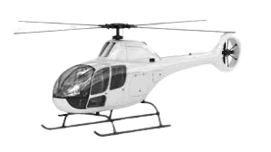
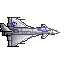

# Sky Battle

**Writer: Blaise Pascal SHYAKA**

# Table of contents

- [Story Overview](#Story-Overview)
- [Game Controls](#Game-Controls)
- [Third party applications](#Third-party-applications)
- [Scenes](#Scenes)
- [HUD system](#HUD-system)
- [Player characters](#Player-characters)
  - [Player](#Player)
  - [Enemies](#Enemies)
- [Player skills](#Player-skills)
- [Health](#Health)
- [Scoring](#Scoring)

## Story Overview

Fighter jets from an unknown country enters your airspace. You only have one helicopter and you try to defend your territory for as long as you can, as you wait for a backup.

## Game Controls

- Use arrow keys on your to move your ship
- Space bar to shot
  
### Third party applications

- Phaser framework
- JavaScript ES6 Modules
- HTML5
- Webpack
- Babel
- Phaser

## Scenes
- **Opening scene** It displays a form to fill in your name, a play button, and a jet image as a background

- **Main Scene**.- The player's helicopter shows up in the middle and then enemy jets start entering the air space with their bombs
- **Game Over**.- When the player's helicopter is hit, the game over scene will show up. It displays your score, as well as options to play again or view the leaderboard.
- **Leader board**.- Display only the top 5 gamers. From here, you have an option to play again.

## HUD system 
There's no any health status, but we could see a score displaying each time player explode or kill an enemy 

## Player characters
  ### Player
    
 

  This is the player, designed to move all over directions

  ### Enemies

  **Enemy Jet**

 

  It will be shooting bombs towards your helicopter

  **Enemy jets' bombs**

  

  These are the bombs enemy jets will be shooting

## Player skills

**Player**.- Moves in any directions around the game scene and can shoot powerful lasers

**Enemy jets**.- Can accelerate and shoot towards the player

## Health 

**Player**.- Die with one shot, have one life and game ends

**Enemy jet**.-Explodes once it is hit

## Scoring

  The player scores 0.005 points once they destroy the enemy bombs; whereas, when the player shoots down a jet, 0.01 points are scored.
