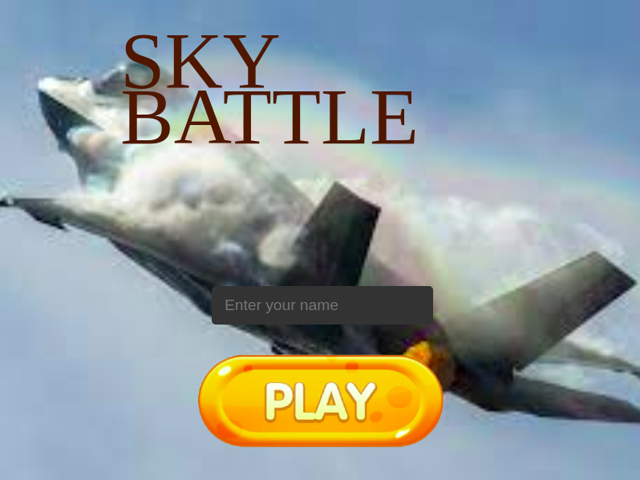

# sky-battle

Sky-Battle is a shooter game developed using phaser. A player uses a super-helicopter to bring down enemy jets. The game is developed specifically for the web.

## Built With 

- Phaser
- HTML5
- JS (ES6)
- Webpack
- Babel

## Live Demo

[Live demo link](https://blaise-shyaka.github.io/sky-battle/)

## Install
### Requirements

- Node JS >= v12

### To run the project locally

- Clone the [repository](https://github.com/Blaise-Shyaka/sky-battle)
- Run `npm install` to install dependencies
- Run `npm start` build the project and start the server 

## How to play 

- Once the game loads, click the "Play" Button
- Use arrow keys to control your helicopter and escape from jets as well as their bombs.
- Use the space bar to shoot down jets and their bombs. The more you shoot, the higher the score.

## Author

👤 **Blaise SHYAKA**

- Github: [@Blaise-Shyaka](https://github.com/Blaise-Shyaka)
- Twitter: [@blaiseshyaka95](https://twitter.com/blaiseshyaka95)
- Linkedin: [blaise-shyaka](https://www.linkedin.com/in/blaise-pascal-shyaka)

## Acknowledgment

- Many thanks to [Open Game Art](https://opengameart.org/) for the free sprites

- Special thanks to [Codecademy](https://codecademy.com/) for making available free phaser tutorials  

## 🤝 Contributing

Contributions, issues and feature requests are welcome! 

- Fork the project
- Clone the project to your local machine
- Create a new branch  `git checkout -b your-branch-name`
- Make your contributions
- Push your branch up to your forked repository
- Open a Pull Request with a detailed description to the development branch of the original project for a review

## Show your support

If you loved this project, please hit the ⭐️ button.

## 📝 License

This project is [MIT](./LICENSE) licensed.